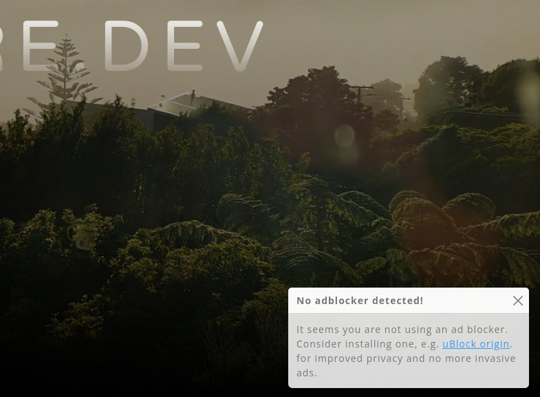

# Repository moved

https://codeberg.org/Firesphere/silverstripe-adblockwarning

# Adblock Warning for Silverstripe

Help your users understand the importance of using an adblocker, by alerting
those that don't have one.

## Demo

Disable your adblocker and visit my website:

https://firesphere.dev



## Defaults

The included template is based on Bootstrap 5.

Note, the (big) list of classnames is part of the functionality!

## Installation

`composer require firesphere/adblockwarning`

## Usage

In your template, include the following:

`$AdblockWarning`

## Customising

Copy the contents of the Templates folder to your theme or app, and modify to your likings.

Contents of heading/notification are editable via the SiteConfig.

# Thanks

[Beko Pharm](https://social.tchncs.de/@bekopharm/111082075749714822)


# Did you read this entire readme? You rock!

Pictured below is a cow, just for you.

```
               /( ,,,,, )\
              _\,;;;;;;;,/_
           .-"; ;;;;;;;;; ;"-.
           '.__/`_ / \ _`\__.'
              | (')| |(') |
              | .--' '--. |
              |/ o     o \|
              |           |
             / \ _..=.._ / \
            /:. '._____.'   \
           ;::'    / \      .;
           |     _|_ _|_   ::|
         .-|     '==o=='    '|-.
        /  |  . /       \    |  \
        |  | ::|         |   | .|
        |  (  ')         (.  )::|
        |: |   |;  U U  ;|:: | `|
        |' |   | \ U U / |'  |  |
        ##V|   |_/`"""`\_|   |V##
           ##V##         ##V##
```
